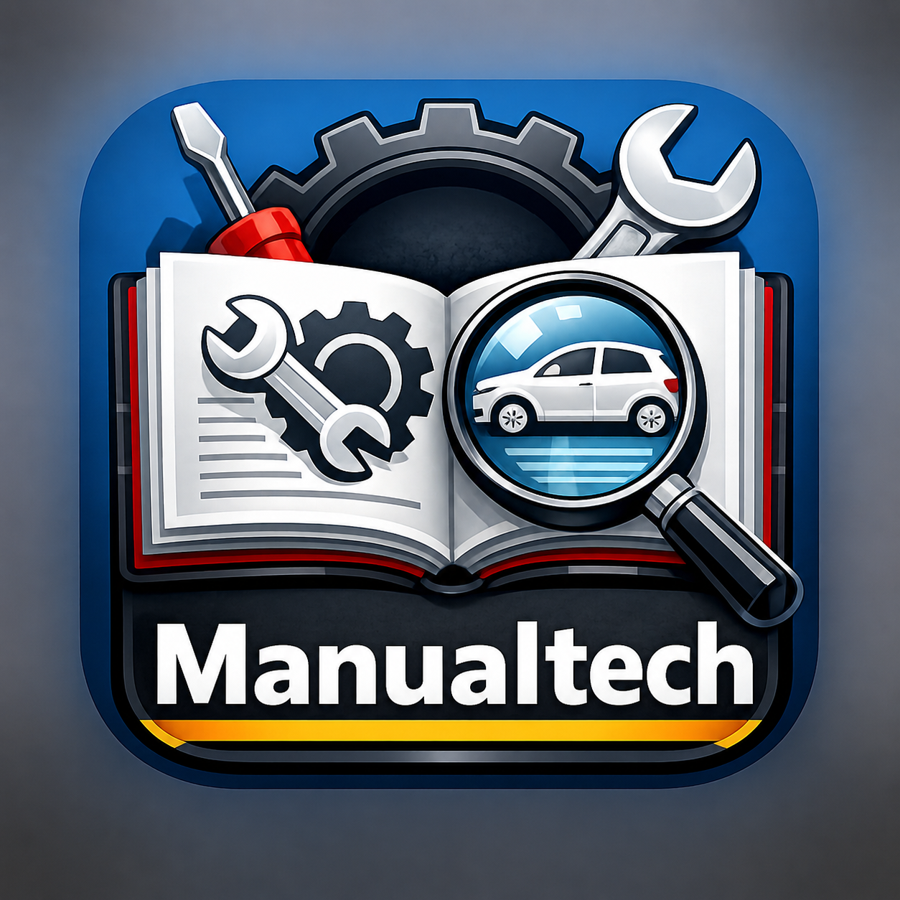

# Manualtech



Manualtech es una aplicación local de escritorio para Windows, propiedad de MSL
MotorSuiteLab, pensada para guardar, clasificar, indexar y buscar manuales de
taller sin usar servidores, nube ni servicios de pago.

El objetivo es sencillo: añadir PDFs o carpetas de imágenes de manuales, extraer
texto página por página, aplicar OCR local si hace falta, indexarlo en SQLite
FTS5 y encontrar rápidamente una avería, pieza, procedimiento, código o sistema
dentro de toda la biblioteca local.

## Estado comercial

Manualtech 1.0.0 está preparado como **beta comercial de pago** para un grupo
controlado de usuarios.

La venta y distribución autorizada debe realizarse exclusivamente a través de:

https://motorsuitelab.com

Manualtech es software propietario de MSL MotorSuiteLab. No se concede permiso
para copiar, revender, redistribuir, republicar ni crear versiones derivadas sin
autorización escrita. Consulta `LICENSE.txt` y `EULA.txt`.

## Condiciones comerciales

La compra, entrega digital, soporte y posibles reembolsos de Manualtech se
regulan por las condiciones publicadas en https://motorsuitelab.com.
Manualtech no incluye manuales de taller ni documentación oficial de
fabricantes. El usuario añade su propia documentación bajo su responsabilidad.

## Funciones principales

- Aplicación de escritorio local creada con Python y PySide6.
- Activación local mediante serial simple, sin servidor.
- Biblioteca local de manuales en PDF.
- Importación de PDFs individuales.
- Importación de carpetas con imágenes JPG, PNG, BMP, TIFF o WEBP.
- Conversión local de imágenes a PDF.
- Extracción de texto con PyMuPDF.
- OCR local opcional para PDFs escaneados o carpetas de imágenes.
- Base de datos SQLite creada automáticamente.
- Búsqueda de texto completo con SQLite FTS5.
- Resultados con documento, página, fragmento y metadatos.
- Fragmentos con coincidencias resaltadas.
- Vista previa de la página encontrada renderizada como imagen.
- Apertura del PDF desde el programa, intentando abrir en la página encontrada
  cuando el visor lo permite.
- Clasificación por categoría: coche, moto, reparación general,
  electrónica/diagnosis, herramientas/procedimientos, ficha propia u otro.
- Gestión de biblioteca desde un diálogo separado.
- Reindexado completo.
- Eliminación de manuales.
- Logo e icono de Manualtech.
- Instalador de Windows con Inno Setup, EULA y desinstalador.

## Privacidad

Manualtech trabaja en local.

- No sube PDFs a internet.
- No necesita servidor.
- No necesita cuenta.
- No necesita suscripciones.

Los manuales, la base de datos, las previews, la activación local y los logs se
guardan en el equipo del usuario.

## Archivos incluidos

El ZIP oficial de Manualtech incluye únicamente:

- `Manualtech_1.0.0_Setup.exe`
- `README.md`
- `LICENSE.txt`
- `EULA.txt`
- `THIRD_PARTY_NOTICES.md`

No incluye código fuente, generadores de claves, manuales privados, base de
datos, logs, previews ni documentación comercial interna.

## Requisitos

- Windows 10 u 11.
- Permisos para instalar aplicaciones en la cuenta del usuario.
- Espacio suficiente para guardar la biblioteca local de manuales.

Manualtech no requiere Python instalado en el ordenador del usuario final.

## Instalación y activación

1. Descomprime el ZIP descargado desde el canal oficial.
2. Ejecuta `Manualtech_1.0.0_Setup.exe`.
3. Sigue los pasos del instalador.
4. Abre Manualtech desde el acceso directo creado.
5. Introduce la clave de activación recibida tras la compra.

En modo instalado, los datos del usuario se guardan normalmente en:

```text
%LOCALAPPDATA%\Manualtech\
```

## Uso básico

1. Activa Manualtech con un serial válido.
2. Pulsa `Añadir PDF` para importar un manual en PDF.
3. Completa los metadatos disponibles: categoría, título, tema, marca, modelo,
   año, motor, sistema, tipo, idioma y notas.
4. Manualtech copia el PDF a la biblioteca local.
5. Extrae el texto página por página.
6. Guarda las páginas en SQLite e indexa el contenido con FTS5.
7. Busca desde la barra superior.
8. Selecciona un resultado para ver la preview de la página.
9. Usa `Abrir PDF` para abrir el documento con el visor predeterminado.

## Rendimiento con bibliotecas grandes

Manualtech está preparado para manejar bibliotecas con muchos documentos y miles
de páginas, con estas decisiones técnicas:

- Indexado página a página por streaming para no cargar todo el texto del PDF en
  memoria antes de guardarlo.
- SQLite en modo WAL para mejorar lecturas y escrituras locales.
- SQLite FTS5 en modo external content para reducir duplicación de texto en la
  base de datos.
- Búsquedas limitadas a resultados relevantes para evitar saturar la interfaz.
- Cache de previews limitada para que `data/previews/` no crezca sin control.
- Reindexado con optimización del índice FTS al terminar.

Limitaciones actuales:

- La importación y el OCR se ejecutan en el proceso principal; durante manuales
  grandes la interfaz puede quedar ocupada aunque muestre progreso.
- El OCR de PDFs escaneados sigue siendo la operación más lenta.
- Carpetas con miles de imágenes muy pesadas pueden requerir mucha memoria al
  convertirse a PDF.

## Carpetas de imágenes y OCR

Manualtech puede importar una carpeta de imágenes y convertirla a PDF. Es útil
cuando un manual está formado por páginas sueltas en JPG o PNG.

Formatos aceptados:

- `.jpg`
- `.jpeg`
- `.png`
- `.bmp`
- `.tif`
- `.tiff`
- `.webp`

Después de crear el PDF, Manualtech intenta aplicar OCR local para que el
contenido sea buscable.

## OCR local

El OCR no usa nube ni APIs. Se hace en local mediante Tesseract/OCR integrado
por PyMuPDF.

El proyecto incluye datos OCR básicos en:

```text
data/tessdata/eng.traineddata
data/tessdata/spa.traineddata
```

Si necesitas una instalación completa de Tesseract en Windows, puedes instalarla
con:

```powershell
winget install --id UB-Mannheim.TesseractOCR -e
```

El OCR es más lento que extraer texto normal. Un manual escaneado grande puede
tardar varios minutos.

## Licencia

Manualtech es software propietario de MSL MotorSuiteLab. Su distribución
comercial autorizada se realiza exclusivamente desde `motorsuitelab.com`.

Consulta:

- `LICENSE.txt`
- `EULA.txt`
- `THIRD_PARTY_NOTICES.md`

## Componentes de terceros

Manualtech utiliza componentes de terceros con sus propias licencias. Consulta
`THIRD_PARTY_NOTICES.md` para más información.
